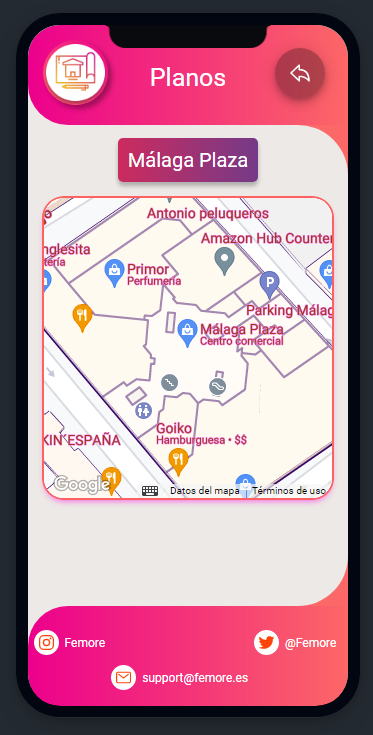

# **FEMORE**
 Femore es una aplicación diseñada para dispositivos móviles que te permite ver los **centros comerciales** de cada locacalidad de España, así como sus respectivos mapas interactivos en los que podrás ver las diferentes tiendas y servicios de ocio.

El usuario tendrá la opción de **registrarse** y **loguearse**, teniendo así la opción de poder **calificar** los centros comerciales y realizar su respectica **reseña**, pudiendo ver en todo momento las reseñas que hayan realizado los demás usuarios.

El **perfil de usuario** consta de características tales como:
- Edición del **nombre** del usuario.
- Cambio de **contraseña** del usuario

Si el usuario **olvida** su contraseña, tendrá la opción de **recuperarla** mediante su correo electrónico, en el que le enviaremos un mail con las opciones para recuperarla.

### **Reseñas**
El funcionamiento de las reseñas trata de: un usuario podrá escribir una reseña en cualquier centro, pero ***NO*** podrá escribir más de 1 reseña en el mismo centro; esta reseña constará de una **descripción** en texto y una **puntuación**, que permitirá ***sólo*** valores de entre **1 y 5**, incluyéndo decimales.

### **Tecnologías utilizadas**
* Ionic y Android
* Capacitor
* Firebase, Cloud Firestore y Authentication
* Google Cloud y Maps JavaScript API
### **Estructura del proyecto**
* 8 Páginas
* 2 Componentes
* 4 Modelos
* 4 Servicios
### **Base de datos**

#
### Video explicativo - [Femore](https://www.youtube.com/watch?v=2JJ34R-AriQ)
#
### [APK - FEMORE](https://mega.nz/file/zHJnlZhQ#OQLmDwW5TtFh6rQ0OUD_Va70Sr46NFfn8R0S0VzfzTg)
#

 
<h2>Femore - Ionic</h2>

 
### Landing Page

### Login

### Registro
 
### Recuperar contraseña

### Centros
 
# ---
 
# ---
 
### Cambio de centro
 
# ---

### Opciones menú

### Perfil
 
# ---

### Cambio de contraseña
 
# ---

### Mapa
 
### Sesión cerrada

#

 
<h2>Femore Admin - Angular</h2>

 
### Inicio

# ---

### Usuarios

# ---

### Eliminar Usuario

# ---

# ---

### Añadir Usuario

# ---

# ---

# ---
### Centros

# ---

# ---

# ---

# ---

